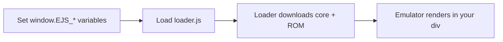

This guide walks you through embedding EmulatorJS from scratch. You will have a working emulator on a page by the end. No build tools or server setup required — just HTML.

<Note>
  This guide uses the public CDN at `https://cdn.emulatorjs.org/`. To serve all assets yourself, see the [Self-Hosting Guide](/guides/self-hosting).
</Note>

## Before you start

You need two things:

- A ROM file for the game you want to run (you must own the game)
- A system identifier (`EJS_core`) for that game — see [Supported Systems](/supported-systems)

---

## How it works

EmulatorJS is initialized entirely through global `window.EJS_*` variables. You set those variables, then load `loader.js`. The loader reads them, downloads the correct emulator core, and boots the game inside a container element you specify.



---

## Step-by-step setup

<Steps>
  <Step title="Add a container element">
    Add a `<div>` where you want the emulator to appear. Give it an `id` — you will reference this in the next step.

    ```html index.html
    <div id="game"></div>
    ```

    The emulator fills this element completely, so size it with CSS:

    ```html index.html
    <style>
      #game {
        width: 640px;
        height: 480px;
      }
    </style>
    ```
  </Step>

  <Step title="Set the required configuration variables">
    Before loading `loader.js`, set these four variables on `window`:

    ```javascript
    window.EJS_player   = "#game";          // CSS selector for your container div
    window.EJS_gameUrl  = "roms/mario.nes"; // Path or URL to your ROM file
    window.EJS_core     = "nes";            // System identifier (see Supported Systems)
    window.EJS_pathtodata = "https://cdn.emulatorjs.org/stable/data/";
    ```

    | Variable | Type | Description |
    |---|---|---|
    | `EJS_player` | string | CSS selector for the container `<div>` |
    | `EJS_gameUrl` | string | URL or local path to the ROM file |
    | `EJS_core` | string | System identifier — see [Supported Systems](/supported-systems) |
    | `EJS_pathtodata` | string | Base URL for EmulatorJS assets |

    <Tip>
      `EJS_pathtodata` must end with a trailing slash. Replace `stable` with `latest` or `nightly` to use a different release channel.
    </Tip>
  </Step>

  <Step title="Load loader.js">
    Add the `loader.js` script tag **after** your variable declarations. The loader must be the last script that runs.

    ```html index.html
    <script src="https://cdn.emulatorjs.org/stable/data/loader.js"></script>
    ```

    <Warning>
      Load `loader.js` as a plain `<script>` tag, not as a module. It reads `document.currentScript` to determine its own path.
    </Warning>
  </Step>
</Steps>

---

## Complete examples

<CodeGroup>

```html Minimal example
<!DOCTYPE html>
<html lang="en">
  <head>
    <meta charset="utf-8">
    <title>EmulatorJS Example</title>
    <style>
      #game { width: 640px; height: 480px; }
    </style>
  </head>
  <body>
    <div id="game"></div>

    <script>
      window.EJS_player     = "#game";
      window.EJS_gameUrl    = "roms/mario.nes";
      window.EJS_core       = "nes";
      window.EJS_pathtodata = "https://cdn.emulatorjs.org/stable/data/";
    </script>
    <script src="https://cdn.emulatorjs.org/stable/data/loader.js"></script>
  </body>
</html>
```

```html Full-page example
<!DOCTYPE html>
<html lang="en">
  <head>
    <meta charset="utf-8">
    <title>EmulatorJS Example</title>
    <style>
      body, html { margin: 0; height: 100%; background: #000; }
      #game { width: 100%; height: 100%; }
    </style>
  </head>
  <body>
    <div id="game"></div>

    <script>
      window.EJS_player        = "#game";
      window.EJS_gameUrl       = "roms/mario.nes";
      window.EJS_core          = "nes";
      window.EJS_pathtodata    = "https://cdn.emulatorjs.org/stable/data/";
      window.EJS_gameName      = "Super Mario Bros.";
      window.EJS_startOnLoaded = true;
      window.EJS_volume        = 0.5;
    </script>
    <script src="https://cdn.emulatorjs.org/stable/data/loader.js"></script>
  </body>
</html>
```

</CodeGroup>

---

## Common configuration variables

These are the most commonly used `EJS_*` variables. For the full list, see [Basic Options](/configuration/basic-options).

| Variable | Type | Description |
|---|---|---|
| `EJS_gameName` | string | Display name for the game |
| `EJS_biosUrl` | string | URL to a required BIOS file (system-dependent) |
| `EJS_startOnLoaded` | boolean | Auto-start the game without waiting for user input |
| `EJS_volume` | number | Initial volume, `0` to `1` |
| `EJS_color` | string | Accent color for the emulator UI (hex, e.g. `"#1AAFFF"`) |
| `EJS_defaultControls` | object | Override default gamepad button mappings |
| `EJS_loadStateURL` | string | URL to a save state file to load on startup |
| `EJS_fullscreenOnLoaded` | boolean | Enter fullscreen automatically when the game starts |
| `EJS_threads` | boolean | Enable threading (required for PSP and DOS — needs COOP headers) |

---

## Systems that require BIOS files

Some systems need a BIOS ROM to boot. Pass the path using `EJS_biosUrl`:

```javascript
window.EJS_biosUrl = "bios/scph1001.bin"; // PlayStation BIOS
```

<Warning>
  BIOS files are copyrighted. You must dump them from hardware you own. EmulatorJS does not distribute BIOS files.
</Warning>

Systems that commonly require a BIOS include PlayStation (`psx`), Sega CD (`segaCD`), Sega Saturn (`segaSaturn`), and 3DO (`3do`). See the [BIOS Files guide](/guides/bios-files) for details.

---

## Systems that require threads

PSP (`psp`) and DOS (`dos`) require SharedArrayBuffer, which in turn requires two HTTP response headers:

```
Cross-Origin-Opener-Policy: same-origin
Cross-Origin-Embedder-Policy: require-corp
```

Enable threading by setting `window.EJS_threads = true` and ensure your server sends these headers. See the [Self-Hosting Guide](/guides/self-hosting) for server configuration examples.

---

## Next steps

<CardGroup cols={2}>
  <Card title="Supported systems" icon="gamepad" href="/supported-systems">
    Find the correct `EJS_core` value for your system
  </Card>
  <Card title="Configuration options" icon="sliders" href="/configuration/basic-options">
    Explore all available `EJS_*` variables
  </Card>
  <Card title="Self-hosting" icon="server" href="/guides/self-hosting">
    Serve EmulatorJS assets from your own infrastructure
  </Card>
  <Card title="BIOS files" icon="microchip" href="/guides/bios-files">
    Learn which systems need a BIOS and how to provide one
  </Card>
</CardGroup>
